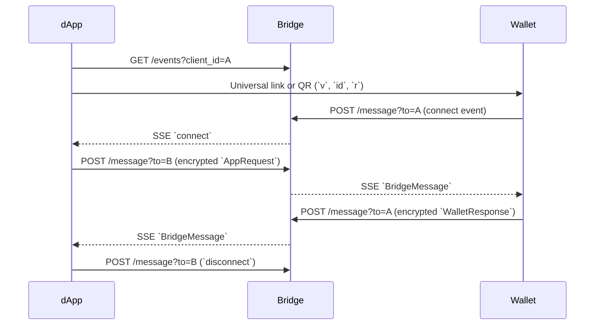

# Overview

This document is normative for dApps, wallets, bridge operators, SDKs. The keywords MUST, MUST NOT, SHOULD, SHOULD NOT and MAY are to be interpreted as described in [RFC 2119](https://www.rfc-editor.org/rfc/rfc2119).

TON Connect is a transport-and-protocol layer for connecting a TON wallet to a decentralised application. It defines:

- A way for the app to discover the wallet and request a connection.
- A way for the wallet to authenticate the user's account.
- An encrypted channel for subsequent RPC requests over an untrusted relay.

## Roles

- **dApp** — the application requesting access. Runs in the user's browser, native app or the wallet's embedded browser.
- **Wallet** — the application that holds the user's key material and signs on the user's behalf.
- **Bridge** — a relay that forwards encrypted messages between the dApp and the wallet. Operated by the wallet provider. Untrusted: it sees only ciphertext on the HTTP bridge, and is bypassed entirely on the JS bridge.

## Message flow (HTTP bridge)

## Workflows

### First-time connection over the HTTP bridge

1. The dApp subscribes to its bridge SSE channel.
2. The dApp sends connection info to the wallet via universal link, deep link or QR code.
3. The wallet reads the parameters, connects to the bridge and stores connection info locally.
4. The wallet sends account information to the dApp over the bridge.
5. The dApp receives the message and stores connection info locally.

### Reconnection over the HTTP bridge

1. The dApp reads connection info from local storage.
2. The dApp reconnects to the bridge.
3. When the user opens the wallet, the wallet reconnects to the bridge using stored connection info.

### First-time connection over the JS bridge

1. The dApp checks for `window.<walletJsBridgeKey>.tonconnect`.
2. The dApp calls `window.<walletJsBridgeKey>.tonconnect.connect()` and awaits the response.
3. The wallet returns account information directly.

### Ordinary requests

1. The dApp and wallet are in a connected state.
2. The dApp generates a request and sends it to the bridge.
3. The bridge forwards the message to the wallet.
4. The wallet generates a response and sends it to the bridge.
5. The bridge forwards the response to the dApp.

## End-to-end encryption invariant

On the HTTP bridge, all dApp requests after the initial connect request, and all wallet responses, MUST be encrypted with the session keypair. The bridge MUST NOT be able to read message bodies. See [`session.md`](./session.md).

On the JS bridge, encryption is unnecessary because both ends share the device. See [`bridge.md`](./bridge.md#js-bridge).

## Reading order

1. [`bridge.md`](./bridge.md) — transport.
2. [`session.md`](./session.md) — encryption.
3. [`deeplinks.md`](./deeplinks.md) — link formats.
4. [`manifest.md`](./manifest.md) — app manifest.
5. [`wallets-list.md`](./wallets-list.md) — wallet registry.
6. [`connect.md`](./connect.md) — connection establishment and `ton_proof` auth signatures.
7. [`rpc.md`](./rpc.md) — RPC methods and events.
